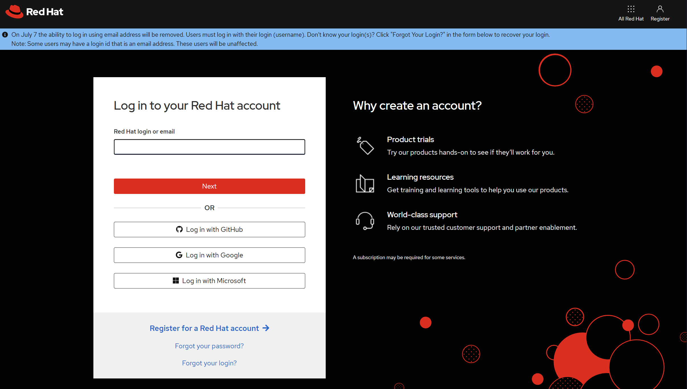
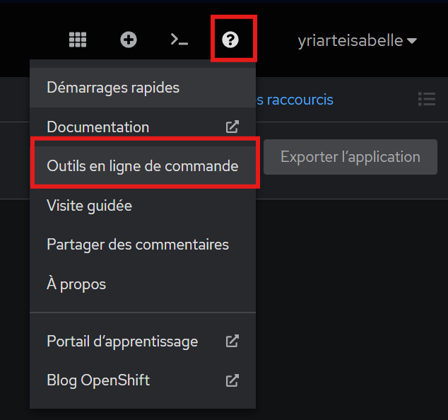

## Exercice 1 : Prise en main de l'interface OpenShift

**Objectif** : Se familiariser avec la console web OpenShift et l'outil CLI.

**Durée** : 30 minutes

**Instructions** :

1. Connexion à la console web OpenShift
   - Ouvrez votre navigateur et accédez à l'URL de la console OpenShift 'https://developers.redhat.com/developer-sandbox'
  
  
---
   - Connectez-vous avec vos identifiants
  
   - Explorez les différentes sections de l'interface (Projets, Applications, Builds, etc.)

2. Installation et configuration de l'outil CLI `oc`
   - Téléchargez l'outil CLI depuis la console web (? en haut à droite > Command Line Tools)
  
   - Installez l'outil sur votre poste de travail
### **Installation oc**  
```bash
# Pour Linux
curl -LO https://mirror.openshift.com/pub/openshift-v4/clients/ocp/latest/openshift-client-linux.tar.gz
tar -xzf openshift-client-linux.tar.gz
sudo mv oc kubectl /usr/local/bin/

# Pour macOS
brew install openshift-cli

# Pour Windows
# Télécharger et extraire depuis le site officiel
```

---

   - Configurez l'accès au cluster :
   - 
  
  
  ``bash
    oc login <URL_API> -u <username> -p <password>
  ```

3. Exploration des commandes de base
   - Affichez la liste des projets :
     ```bash
     oc projects
     ```
   - Affichez les informations sur le cluster (optionnel):
     ```bash
     oc cluster-info
     ```
   - Affichez la liste des nœuds du cluster (optionnel):
     ```bash
     oc get nodes
     ```
   - Affichez la version d'OpenShift :
     ```bash
     oc version
     ```

**Questions de réflexion** :
- Quelles sont les principales différences entre l'interface web et l'outil CLI ?
- Dans quels cas préféreriez-vous utiliser l'interface web plutôt que la ligne de commande, et vice versa ?