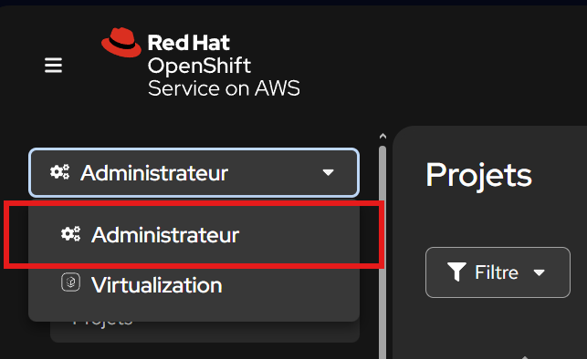
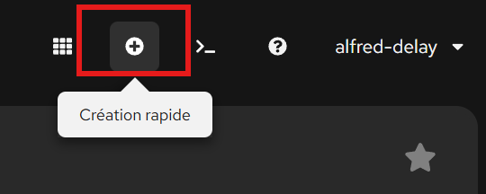
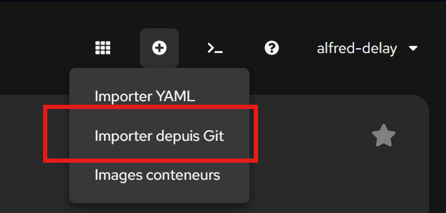
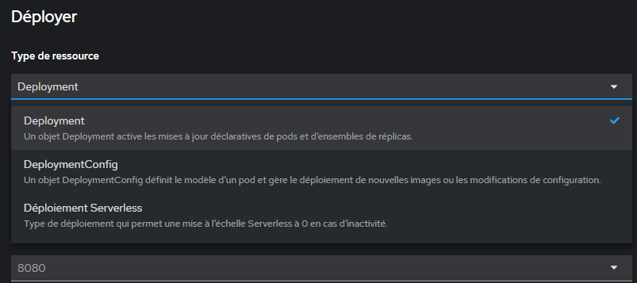
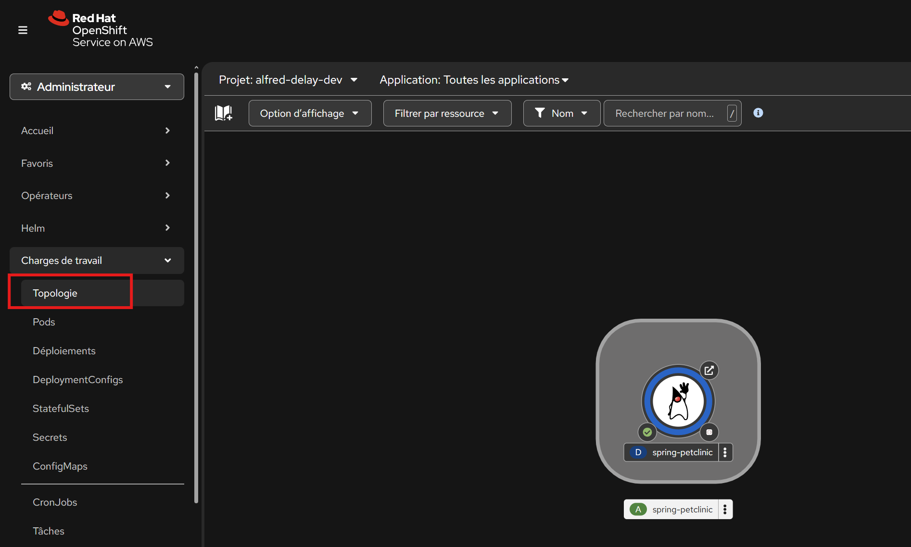
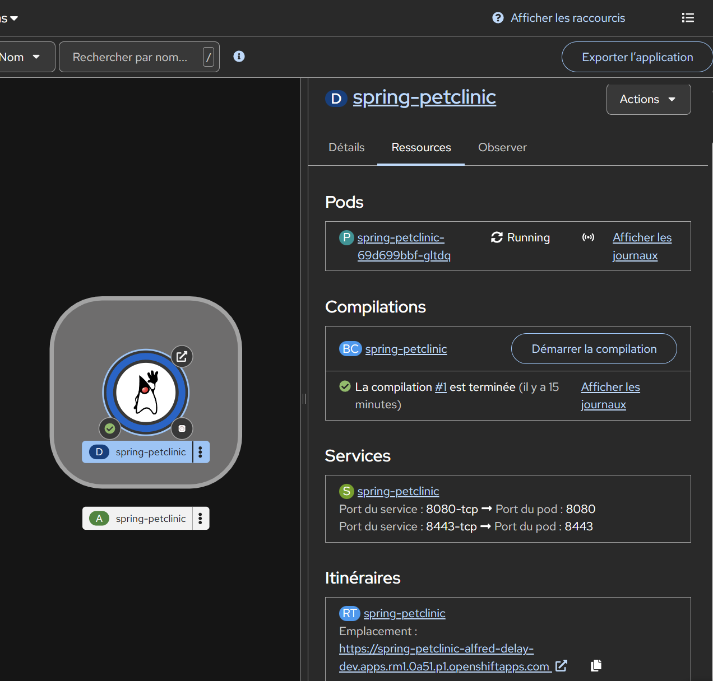
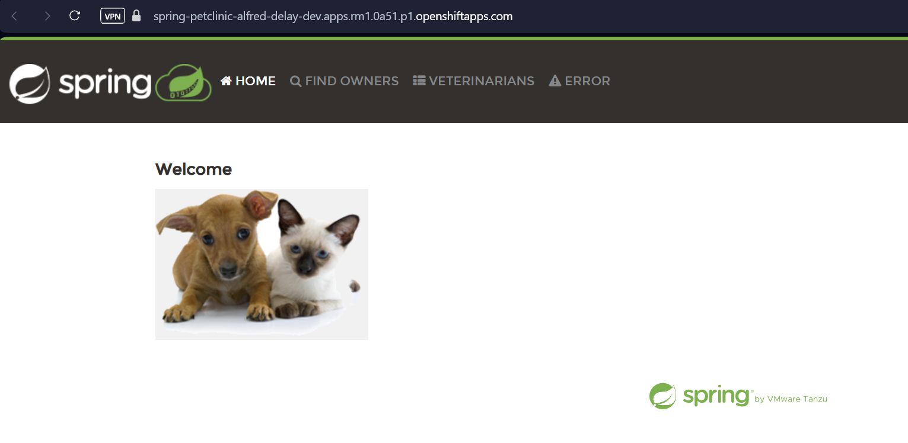

---

## 🖥️ **Exercice découverte : Explorer l’interface OpenShift Web Console**

### **Objectif**

Découvrir les principales fonctionnalités de la console web OpenShift :

* Projets
* Déploiements
* Builds
* Services & Routes
* Observabilité (logs, métriques)

---

### **Étapes**

#### 1. **Connexion**

* Accède à l’URL de la console OpenShift (ex : `https://console-openshift-console.apps.<cluster>.openshiftapps.com`)
* Connecte-toi avec ton compte utilisateur.

#### 2. **Vue Administrator**

* En haut à gauche, sélectionne le mode **Administrator** .



#### 3. **Créer un projet (namespace) --non disponible dans le sandbox**

* Clique sur **Projects** (ou “Créer un projet”)
* Donne un nom (ex : `demo-interface`) et une description.

#### 4. **Déployer une application en 2 clics**

* Dans le menu du haut, cliquez sur l'icone "+" correspondant à création rapide
  

  
* Dans le menu qui apparait choisis **“Import depuis Git”**.
  


* Mets par exemple le repo :

  ```
  https://github.com/spring-projects/spring-petclinic.git
  ```
* Choisissez deploiement dans le type de ressource et laisser les autres options par défaut, clique sur **Create**.



#### 5. **Explorer la topologie**

* Va sur **Topology**.
  


* Clique sur l’icône de ton application : tu vois les pods, routes, builds associés.


#### 6. **Découvrir les menus associés**

* Clique sur ton application, puis sur les différents onglets :

  * **Resources** : voit les déploiements, builds, services.
  * **Pods** : liste des pods, status (Running, CrashLoopBackOff…).
  * **Builds** : vois l’historique et les logs des builds S2I.
  * **Routes** : liens HTTP publics.
  * **Logs** : affiche les logs du pod en live.
  * **Environment** : vois/modifie les variables d’environnement.
  * **Metrics** : explore CPU, RAM consommés.

#### 7. **Ouvre l’application déployée**

* Clique sur la **Route** générée, ouvre-la dans ton navigateur.
https://spring-petclinic-git-alfred-delay-dev.apps.rm1.0a51.p1.openshiftapps.com



#### 8. **Supprime l’application ou le projet**

* Clique sur le menu de l’application → “Delete”
* Vous pouvez aussi surimer toutes les ressources avec cette commande:

```bash
oc delete all --all
```

---
