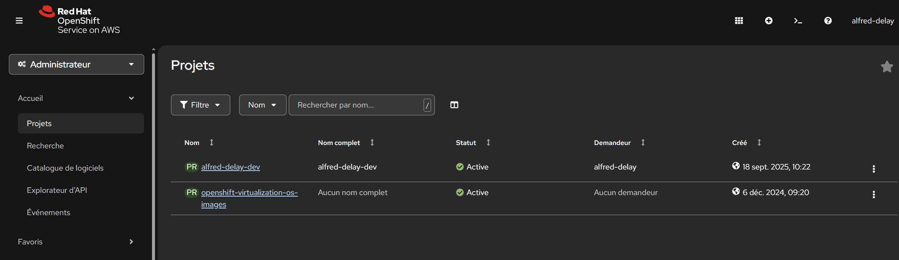
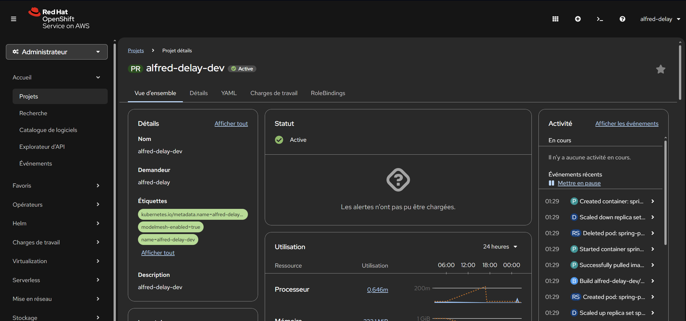
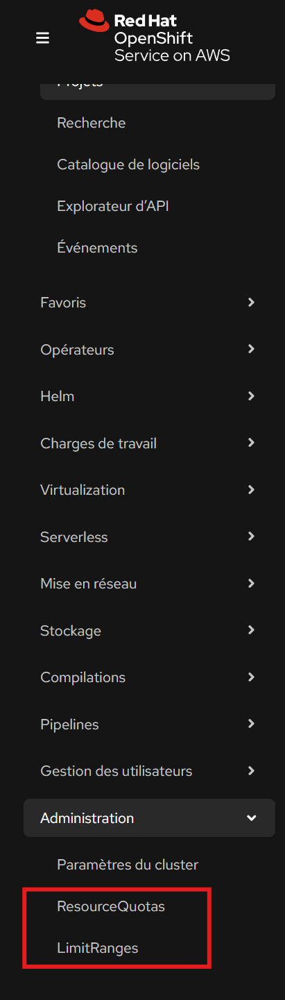
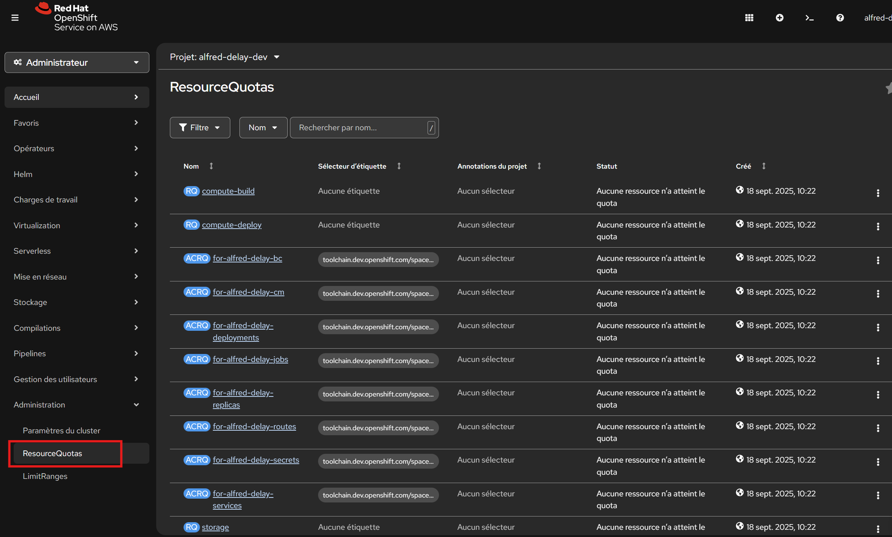
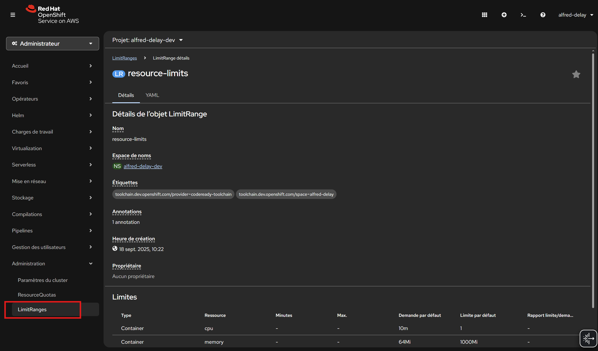
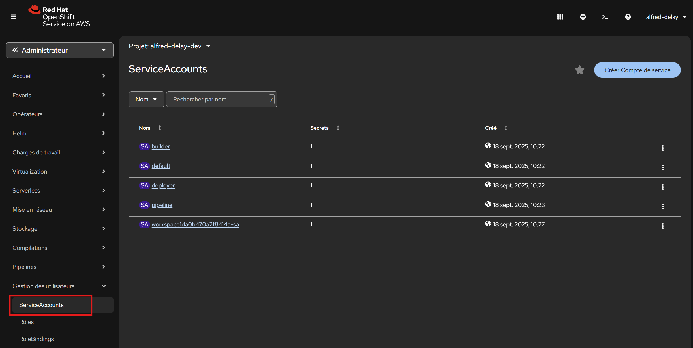
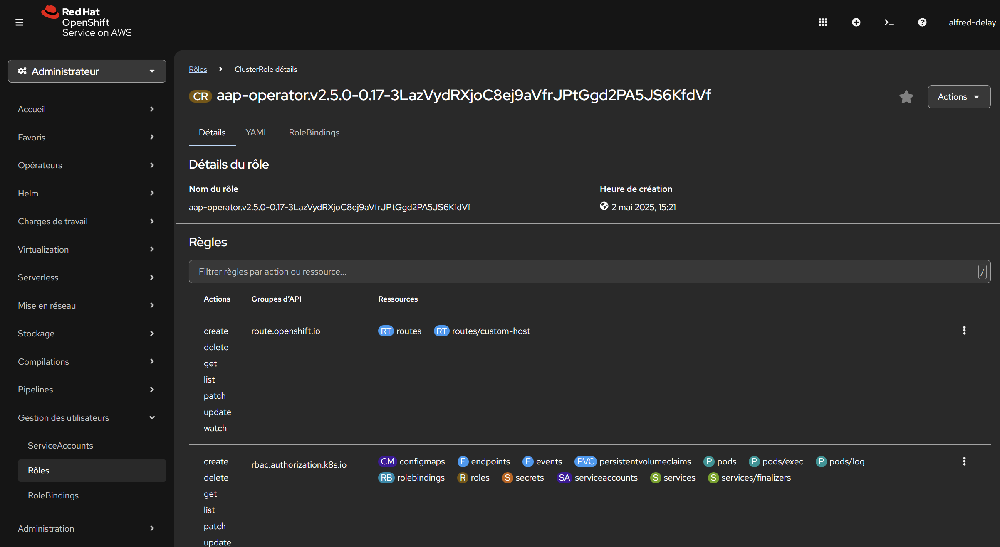
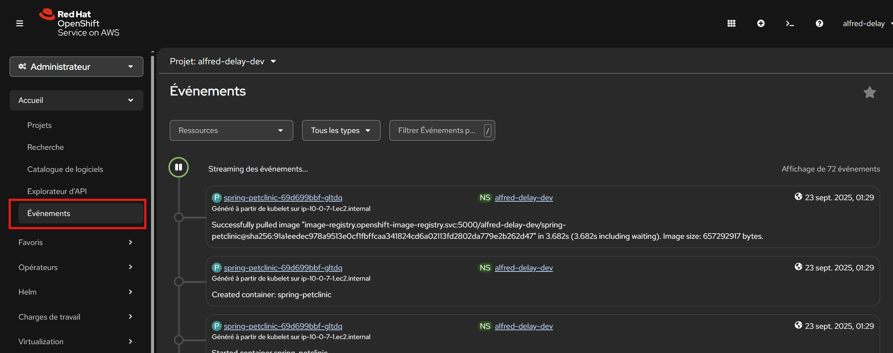
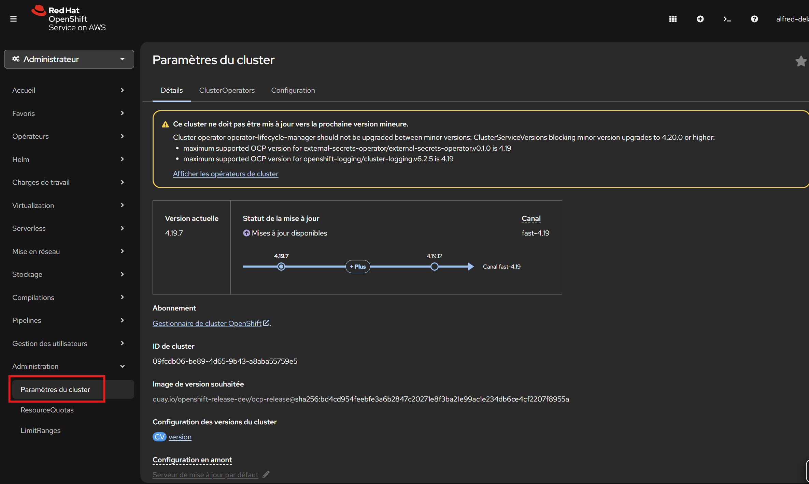

---

## 🛠️ **Exercice découverte : Explorer le mode Administrateur dans OpenShift**

### **Objectif**

Prendre en main les principales fonctionnalités “admin” de la console OpenShift, voir l’infrastructure globale et comprendre comment un administrateur gère les ressources du cluster.

---

### **Étapes**

#### 1. **Passer en mode Administrateur**

* Connecte-toi à la console OpenShift.
* En haut à gauche, clique sur le menu puis choisis **Administrator** (au lieu de Developer).

---

#### 2. **Explorer la liste des projets (namespaces)**

* Menu de gauche : **Home** > **Projects**
  ➔ Vois tous les namespaces, date de création, leur statut.

---

#### 3. **Voir les détails de votre projet**

---

#### 4. **Voir les quotas et les limites**

* Menu **Administration** > **ResourceQuotas**
  ➔ Vois les quotas appliqués sur les projets (CPU, RAM, stockage…).

* Menu **Administration** > **LimitRanges**
  ➔ Vois les limites imposées à l’utilisation des ressources.

---

#### 5. **Explorer la gestion des utilisateurs & rôles**
* Menu **Gestion des utilisateurs**

  * **ServiceAccounts** : liste des comptes systèmes utilisés par les pods/applications.

  * **Rôles** : explore les rôles existants (admin, edit, view…) et leurs permissions.
 
  * **RoleBindings** : vois comment sont assignés les rôles aux utilisateurs/groupes/service accounts.
* **Remarque** :
  *Le menu “Users” n’est pas toujours disponible, car la gestion des utilisateurs réels se fait souvent via une solution SSO ou un IDP externe.*

---

#### 6. **Examiner la gestion des PV/PVC (stockage persistant)**

####  **PersistentVolumeClaims (PVC)**

* Menu : **Stockage** > **PersistentVolumeClaims**

  * Découvre la liste des volumes réclamés par les applications dans tous les projets.
  * Clique sur un PVC pour voir sa taille, son statut, le projet associé, et sa classe de stockage.
  * Observe quelles applications (pods) utilisent ce PVC.

####  **StorageClasses**

* Menu : **Stockage** > **StorageClasses**

  * Liste les types de stockage disponibles dans le cluster (standard, fast, file, etc.).
  * Pour chaque StorageClass, observe : le type de provisioner, les options de rétention, le mode de binding automatique ou manuel.

####  **VolumeSnapshots**

* Menu : **Stockage** > **VolumeSnapshots**

  * Liste des snapshots (sauvegardes ponctuelles) pris sur des PVCs.
  * Découvre comment on peut créer ou restaurer un snapshot pour un volume.

####  **VolumeSnapshotClasses**

* Menu : **Stockage** > **VolumeSnapshotClasses**

  * Découvre les “classes” de snapshots : elles déterminent le type de snapshot (disque, fichier), le provider utilisé, les paramètres spécifiques.

---

####  **Consulter les logs et événements du cluster**

* Menu **Acceuil** > **Evénements**
  ➔ Parcours les événements récents : erreurs, changements, schedulings, etc.

---

####  **La configuration du cluster**

* Menu **Administration** > **Cluster Settings**
  ➔ Version OpenShift, historiques des mises à jour, état des opérateurs, etc.

---
