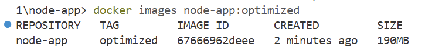
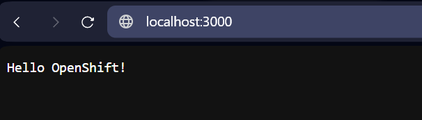
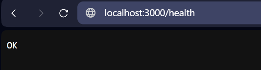

# Exercice pratique 1 : Multi-stage build

## Objectif
Optimiser une image Node.js avec multi-stage build

## Description
Dans cet exercice, vous allez créer un Dockerfile optimisé pour une application Node.js en utilisant la technique du multi-stage build. Cette approche permet de séparer l'environnement de build de l'environnement de production, réduisant ainsi la taille finale de l'image.

## Étapes à suivre

### 1. Préparation de l'environnement
Créez un dossier `node-app` et initialisez une application Node.js simple :

```bash
mkdir node-app
cd node-app
```

### 2. Création du serveur HTTP
Créez un fichier `server.js` avec un serveur HTTP basique :

```javascript
const http = require('http');

const server = http.createServer((req, res) => {
  if (req.url === '/health') {
    res.writeHead(200);
    res.end('OK');
    return;
  }
  
  res.writeHead(200, {'Content-Type': 'text/plain'});
  res.end('Hello OpenShift!\n');
});

const PORT = process.env.PORT || 3000;
server.listen(PORT, () => {
  console.log(`Server running on port ${PORT}`);
});
```

### 3. Configuration des dépendances
Créez un `package.json` avec les dépendances nécessaires :

```json
{
  "name": "node-app",
  "version": "1.0.0",
  "main": "server.js",
  "scripts": {
    "start": "node server.js"
  },
  "dependencies": {
    "express": "^4.17.1"
  }
}
```

### 4. Création du Dockerfile multi-stage
Écrivez un Dockerfile multi-stage qui sépare l'environnement de build de l'environnement de production. Votre Dockerfile doit inclure :
- Un stage de build pour installer les dépendances
- Un stage de production avec une image plus légère
- Un utilisateur non-root pour la sécurité
- Un HEALTHCHECK pour vérifier l'état de l'application

### 5. Construction de l'image
Construisez l'image avec `docker build` et vérifiez sa taille (assurez vous d'être dans le répertoire `node-app`):

```bash
npm install
docker build -t node-app:optimized .
docker images node-app:optimized
```


### 6. Test de l'application
Testez l'application en exécutant un conteneur à partir de votre image :

```bash
docker run -p 3000:3000 node-app:optimized
```

Vérifiez que l'application répond sur `http://localhost:3000` et que le endpoint de santé fonctionne sur `http://localhost:3000/health`.





## Structure de fichiers attendue

```
node-app/
├── server.js
├── package.json
└── Dockerfile
```

## Conseils
- Utilisez `node:14-alpine` comme image de base pour réduire la taille
- Pensez à implémenter un HEALTHCHECK pour vérifier l'état de votre application
- Utilisez un utilisateur non-root pour améliorer la sécurité
- Optimisez l'ordre des instructions pour tirer parti du cache Docker

## Résultat attendu
Une image Docker optimisée avec :
- Une taille réduite grâce au multi-stage build
- Un utilisateur non-root pour la sécurité
- Un HEALTHCHECK fonctionnel
- L'application accessible via le port 3000

## Validation
Pour valider votre exercice, vérifiez que :
1. L'image se construit sans erreur
2. L'application démarre correctement
3. Le endpoint `/health` retourne un statut 200
4. L'image utilise un utilisateur non-root
5. La taille de l'image est optimisée (comparée à une version sans multi-stage build)

