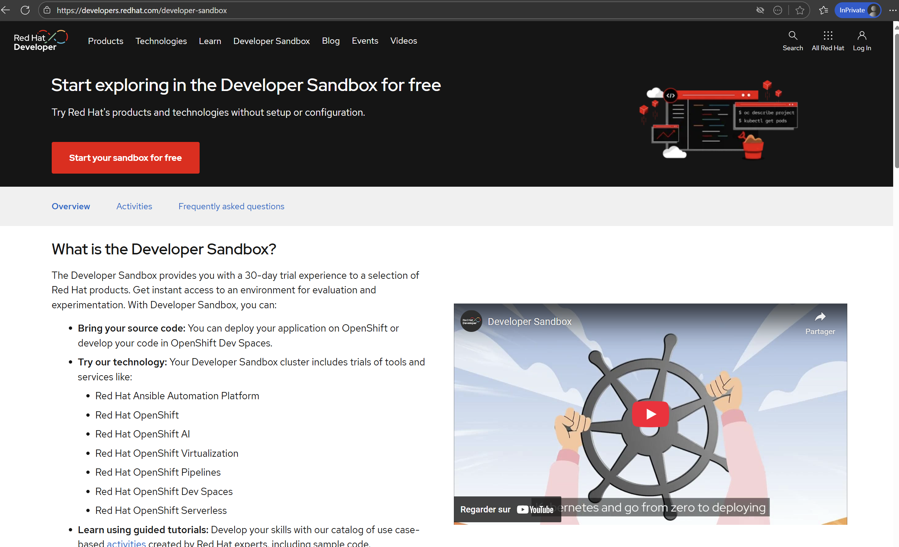
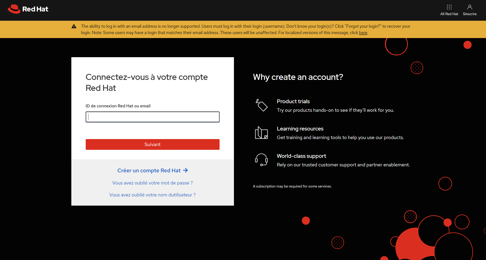
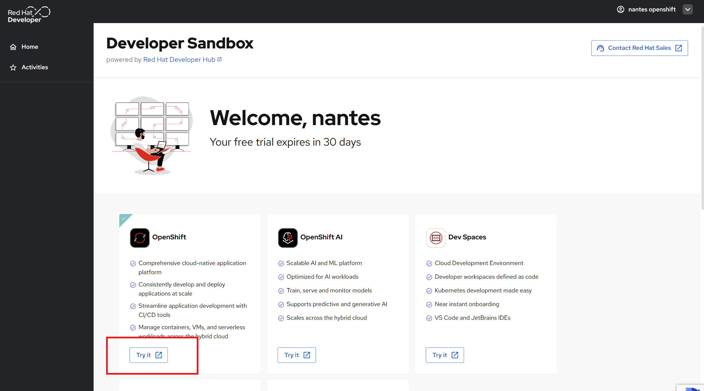
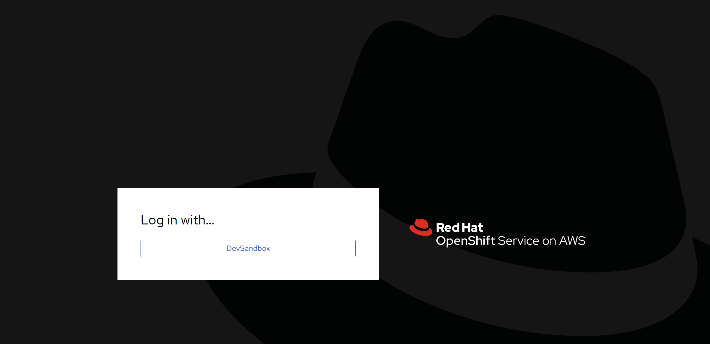
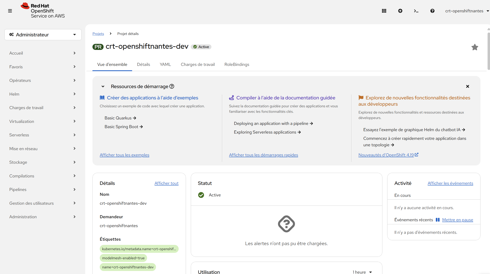

---

### ✅ **Étapes pour créer un compte sur OpenShift Sandbox**

1. ### 🔗 **Aller sur le site officiel**

   Accédez à cette URL :
   👉 [https://developers.redhat.com/developer-sandbox](https://developers.redhat.com/developer-sandbox)

   

2. ### 🔴 **Cliquer sur le bouton rouge**

   Cliquez sur le bouton :
   **"Start your sandbox for free"**

3. ### 👤 **Créer un compte Red Hat Developer**

   Si vous n’avez pas encore de compte Red Hat :

   * Cliquez sur **"Register"**
   * Remplissez le formulaire (Nom, Email, Mot de passe, etc.)
   * Validez l’email de confirmation envoyé dans votre boîte mail

4. ### 🔐 **Connexion au portail**

   Une fois le compte créé, connectez-vous avec vos identifiants Red Hat Developer. Et appuyez sur 'Launch' dans la tuile Openshift
    

    

5. ### 📦 **Lancement de l’environnement sandbox**

   * Une fois connecté, cliquez à nouveau sur **"Start your sandbox"**
   * Le système va provisionner un environnement OpenShift (cela peut prendre quelques minutes)
   * Vous recevrez un lien vers votre **cluster OpenShift personnalisé**
  

---

### 📝 Remarques :

* L’accès est **gratuit** pour une durée limitée (habituellement 30 jours renouvelables)
* Nécessite un compte **Red Hat Developer Program**
* Aucune configuration ou installation locale n’est nécessaire
